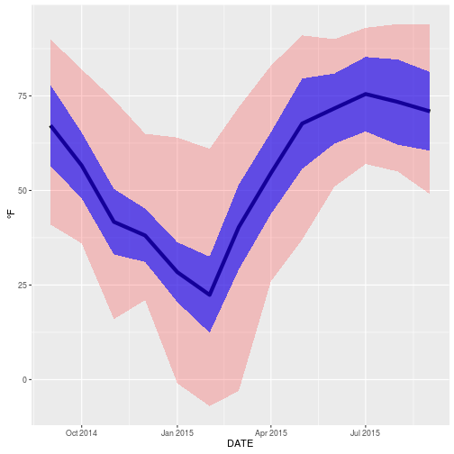

WV Climate Display for Data Products Class
========================================================
author: Brian Werner
date: September 22, 2016

Why Weather Data?
========================================================
- Weather information is important to many industries
- Weather affects vacation and planning of other outdoor activities

Data Source
========================================================
Data product is pulled from the Nation Climate Data Center (NCDC). The NCDC is primarily responsible for maintaining a persistant record of climate data.
The website allows users to submit requests for data products from a variety of datasets. The system has restrictions on the size of the file so to acquire multiple years, even for one state, required pulling multiple requests together.
A separate listing of distinct Station Names was extracted from the climate data records.

Data Preparation
========================================================

```r
wv_2015_2005_month <- read.csv("WV2015_2005_Annual_Summ.csv",header = TRUE)
wv_2004_1995_month <- read.csv("WV2004_1995_Annual_Summ.csv",header = TRUE)
monthly_data <- merge(wv_2015_2005_month,wv_2004_1995_month,all = TRUE)
monthly_data$DATE <- as.Date(monthly_data$DATE)
monthly_station_names <- wv_2015_1995_monthly %>% distinct(STATION) %>% select(STATION,STATION_NAME,ELEVATION,LATITUDE,LONGITUDE)
monthly_station_names <- monthly_station_names %>% arrange(STATION_NAME)
```

Data Display
========================================================
The monthly data is displayed. The available data attributes are, Extreme minimum temperature reported in month (EMNT), Extreme maximum temperature reported in month (EMXT), Monthly mean minimum temperature (tenths of degrees) (MMNT), Monthly mean maximum temperature (tenths of degrees) (MMXT), and Monthly mean temperature (tenths of degrees) (MNTM).

### Data Plot
The center line indicates the average temperature during the time period. The blue area indicates the extent of the average maximum temperature and average minimum temperature per month. The red area indicates extreme limits observed per month.

Display Plot
========================================================


```r
thisStation <- monthly_data %>% filter(STATION_NAME=="MORGANTOWN HART FIELD WV US",DATE<="2015-09-01",DATE>="2014-09-01") %>% arrange(DATE)
ggplot(thisStation,aes(x=DATE)) + geom_line(aes(x=DATE,y=MNTM),size=2) + geom_ribbon(aes(x=DATE,ymax=EMXT,ymin=EMNT),alpha=0.2,fill="red") + geom_ribbon(aes(x=DATE,ymax=MMXT,ymin=MMNT),alpha = 0.6,fill= "blue") + ylab(expression(""*~degree*F))
```


